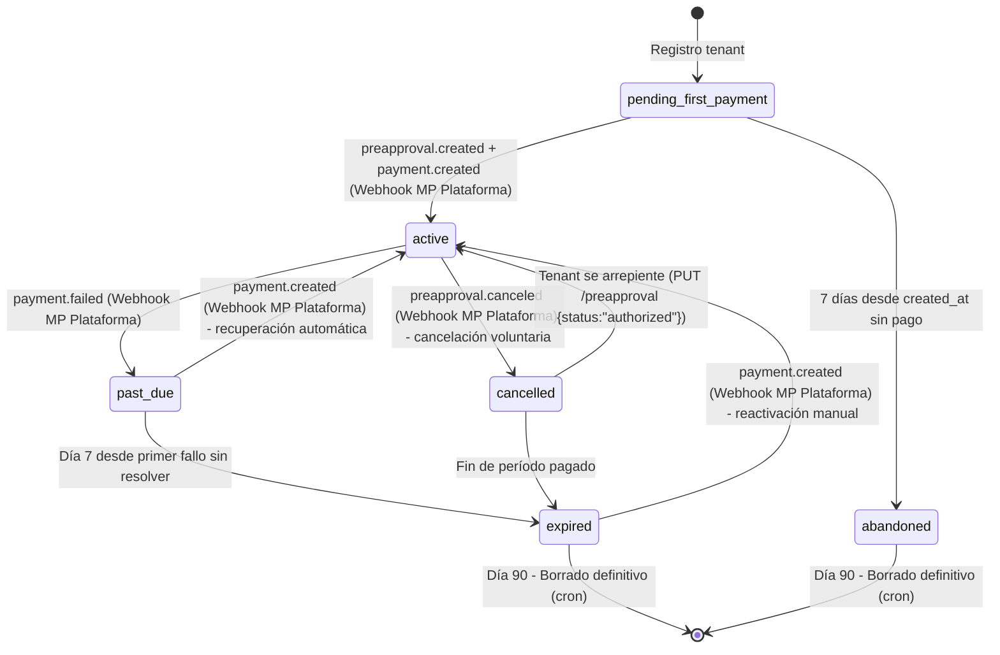

# Spec Transversal — Ciclo de vida de suscripciones

**Fecha:** 2026-09-17
**Versión:** 1.0
**Estado:** Single source of truth para todas las fases

> **Referencia:** Cada fase del blueprint que toque suscripciones debe referenciar este documento en lugar de duplicar lógica.

---

## 1. Máquina de estados (6 estados)

### Estados

| Estado                  | Descripción                                                  | Acceso panel   | Tienda pública          |
| ----------------------- | ------------------------------------------------------------ | -------------- | ----------------------- |
| `pending_first_payment` | Registrado, pago inicial pendiente                           | ❌ Bloqueado   | ❌ No publicada         |
| `active`                | Al día, suscripción vigente                                  | ✅ Completo    | ✅ Funcionando          |
| `past_due`              | Pago falló (dentro de gracia 7 días)                         | ⚠ Limitado     | ✅ Funcionando          |
| `cancelled`             | Canceló voluntariamente (vence al fin de período)            | ⚠ Solo lectura | ✅ Hasta fin de período |
| `expired`               | Pasó gracia sin pagar                                        | ❌ Bloqueado   | ❌ Despublicada         |
| `abandoned`             | Nunca completó primer pago (7 días desde registro sin pagar) | ❌ Bloqueado   | ❌ No publicada         |

### Transiciones válidas



### Qué dispara cada transición

| Transición                            | Disparador                                                          | Origen                                   |
| ------------------------------------- | ------------------------------------------------------------------- | ---------------------------------------- |
| `pending_first_payment` → `active`    | `preapproval.created` + `payment.created`                           | Webhook MP Plataforma (`MP_PLATFORM_*`)  |
| `pending_first_payment` → `abandoned` | Cron: `created_at + 7d` sin `payment.created`                       | Job interno (cron nocturno, UTC)         |
| `active` → `past_due`                 | `payment.failed` / `payment.rejected`                               | Webhook MP Plataforma                    |
| `past_due` → `active`                 | `payment.created` (pago exitoso reintento)                          | Webhook MP Plataforma                    |
| `past_due` → `expired`                | Cron: día 7 desde primer fallo sin resolver                         | Job interno (cron nocturno, UTC)         |
| `active` → `cancelled`                | `preapproval.canceled` (tenant cancela)                             | Webhook MP Plataforma                    |
| `cancelled` → `expired`               | Fin de `current_period_end`                                         | Job interno (cron nocturno, UTC)         |
| `cancelled` → `active`                | Tenant se arrepiente: `PUT /preapproval/{id} {status:"authorized"}` | Backend (MP_PLATFORM_ACCESS_TOKEN)       |
| `expired` → `active`                  | `payment.created` (pago manual)                                     | Webhook MP Plataforma / Botón "Ya pagué" |
| `expired` → `[borrado]`               | Cron: 90 días desde `expired_at`                                    | Job interno (cron nocturno, UTC)         |
| `abandoned` → `[borrado]`             | Cron: 90 días desde `abandoned_at`                                  | Job interno (cron nocturno, UTC)         |

---

## 2. Reglas de negocio por estado

### Tabla resumen: Estado × Permisos

| Acción                           | `pending_first_payment` | `active`    | `past_due` | `cancelled`            | `expired` | `abandoned` |
| -------------------------------- | ----------------------- | ----------- | ---------- | ---------------------- | --------- | ----------- |
| **Acceder panel admin**          | ❌                      | ✅ Completo | ⚠ Limitado | ⚠ Solo lectura         | ❌        | ❌          |
| **Ver productos/órdenes/config** | ❌                      | ✅          | ✅         | ✅                     | ❌        | ❌          |
| **Crear/editar productos**       | ❌                      | ✅          | ❌         | ❌                     | ❌        | ❌          |
| **Crear/editar categorías**      | ❌                      | ✅          | ❌         | ❌                     | ❌        | ❌          |
| **Gestionar órdenes**            | ❌                      | ✅          | ✅         | ✅                     | ❌        | ❌          |
| **Recibir órdenes (storefront)** | ❌                      | ✅          | ✅         | ✅                     | ❌        | ❌          |
| **Configurar MP, envíos, etc.**  | ❌                      | ✅          | ❌         | ❌                     | ❌        | ❌          |
| **Cambiar de plan**              | ❌                      | ✅          | ❌         | ❌                     | ❌        | ❌          |
| **Tienda pública accesible**     | ❌                      | ✅          | ✅         | ✅ (hasta fin período) | ❌        | ❌          |

### Detalle por estado

**`pending_first_payment`**

- Panel: muestra pantalla "Configura tu MP y paga la suscripción"
- Storefront: 404 o página "Próximamente"
- Webhook MP Plataforma: espera `preapproval.created` → `payment.created`
- Si no paga en 7 días → transiciona a `abandoned` (cron `created_at + 7d`)

**`active`**

- Acceso total al panel y storefront
- Todas las features del tier habilitadas
- Renovación automática mensual vía `preapproval`

**`past_due`** (gracia 7 días)

- Panel: banner superior "Tu pago falló, tienes 7 días para resolver"
- Acciones de escritura bloqueadas (productos, categorías, config)
- Lectura permitida (ver órdenes, productos, stats)
- Storefront: sigue funcionando normal (clientes pueden comprar)
- Emails automáticos día 0, 3, 5, 7
- Webhook MP Plataforma: si llega `payment.created` → back to `active`

**`cancelled`**

- El tenant pidió cancelar → sigue activo hasta `current_period_end`
- Panel: solo lectura, banner "Suscripción cancelada, acceso hasta DD/MM"
- Storefront: funciona hasta fin de período
- No puede cambiar de plan ni configurar nada nuevo
- Al llegar `current_period_end` → `expired`
- **Política:** No se reintegra tiempo no usado (estándar SaaS).
- **Reactivación:** Si el tenant se arrepiente antes de `current_period_end`, puede hacer clic en "Reactivar" en el panel → backend llama `PUT /preapproval/{id} {status:"authorized"}` → MP procesa → webhook (o polling) confirma → transición `cancelled` → `active`. El período se renueva desde la reactivación.

**`expired`**

- Panel: bloqueado, muestra "Cuenta suspendida" + botón "Reactivar"
- Storefront: 404 / despublicada
- Datos retenidos 90 días (desde `expired_at`)
- Webhook MP Plataforma: si llega `payment.created` (pago manual) → `active`
- Día 90 → borrado definitivo (cron sobre `expired_at`)

**`abandoned`**

- Tenant registrado pero nunca completó primer pago (7 días desde `created_at`)
- Panel: bloqueado, muestra "Registro incompleto" + botón "Completar pago"
- Storefront: 404 / no publicada
- Datos retenidos 90 días (desde `abandoned_at`)
- Webhook MP Plataforma: si llega `payment.created` → `active` (raro pero posible)
- Día 90 → borrado definitivo (cron sobre `abandoned_at`)

---

## 3. Período de gracia (dunning)

### Configuración

- **Duración:** 7 días corridos desde el primer fallo de pago
- **Estado durante gracia:** `past_due`
- **Tienda pública:** sigue funcionando (clientes compran normal)
- **Panel admin:** limitado (solo lectura + gestión de órdenes)
- **Crons:** todos corren en **UTC** (ver emails día 0/3/5/7, transición a `expired` día 7)

### Secuencia de emails

| Día | Evento                 | Email                     | Asunto sugerido                               |
| --- | ---------------------- | ------------------------- | --------------------------------------------- |
| 0   | Primer fallo detectado | #3 Pago fallido           | "⚠️ Tu pago no pudo procesarse"               |
| 3   | Recordatorio           | #4 Recordatorio día 3     | "Tu suscripción vence en 4 días"              |
| 5   | Último aviso           | #5 Último aviso día 5     | "Último aviso: 2 días para evitar suspensión" |
| 7   | Suspensión             | #6 Suscripción suspendida | "Tu cuenta ha sido suspendida"                |

### Comportamiento durante gracia

- Órdenes nuevas: **se procesan normal** (el tenant cobra a sus clientes con su MP)
- Renovación: **no se cobra** hasta resolver el pago fallido
- Webhook `payment.created` (reintento MP) → transición inmediata a `active`
- Si MP no reintenta: botón "Ya pagué, verificar" en panel (consulta `/v1/preapproval/{id}`)

---

## 4. Retención de datos

### Política

- **90 días** desde la transición a `expired` (columna `expired_at`) o `abandoned` (columna `abandoned_at`)
- **Qué se borra:** Todo el tenant cascade (ver abajo)
- **Disparador:** Cron nocturno (UTC) que busca:
  - `subscriptions.status = 'expired' AND expired_at < now() - interval '90 days'`
  - `subscriptions.status = 'abandoned' AND abandoned_at < now() - interval '90 days'`

### Columnas nuevas en `subscriptions` (Fase 1)

| Columna                     | Tipo          | Descripción                                                                                                                                                                                                                                |
| --------------------------- | ------------- | ------------------------------------------------------------------------------------------------------------------------------------------------------------------------------------------------------------------------------------------ |
| `expired_at`                | `TIMESTAMPTZ` | Se setea **solo** en transición a `expired`; se limpia (NULL) al reactivar a `active`                                                                                                                                                      |
| `abandoned_at`              | `TIMESTAMPTZ` | Se setea **solo** en transición a `abandoned`; se limpia si paga y va a `active`                                                                                                                                                           |
| `last_processed_payment_id` | `TEXT`        | `payment.id` del último `payment.created` procesado (idempotencia webhooks). NULL inicial.                                                                                                                                                 |
| `current_period_end`        | `TIMESTAMPTZ` | **Nullable.** NULL en `pending_first_payment` / `abandoned`. Seteado a `now() + 1 month` al activar (`active`), reseteado al recobrar (`past_due` → `active`), mantiene valor en `cancelled` hasta fin de período, histórico en `expired`. |

> **Por qué no `updated_at`:** `updated_at` cambia con cualquier update (reintentos, webhooks, etc.) y no refleja el momento real de expiración/abandono.

### Cuándo se setea `current_period_end` según estado

| Estado                  | `currentPeriodEnd`                          |
| ----------------------- | ------------------------------------------- |
| `pending_first_payment` | NULL (todavía no hay período)               |
| `active`                | `now() + 1 month` (seteado al activar)      |
| `past_due`              | Se mantiene (el período pagado sigue)       |
| `cancelled`             | Se mantiene hasta el fin del período pagado |
| `expired`               | Se mantiene (histórico)                     |
| `abandoned`             | NULL (nunca se pagó)                        |

### Tablas afectadas (CASCADE via FK)

| Tabla                            | Relación                     | Acción  |
| -------------------------------- | ---------------------------- | ------- |
| `tenants`                        | PK                           | DELETE  |
| `subscriptions`                  | FK `tenant_id`               | CASCADE |
| `tenant_mp_config`               | FK `tenant_id`               | CASCADE |
| `products`                       | FK `tenant_id`               | CASCADE |
| `product_variants`               | FK `product_id` → `products` | CASCADE |
| `product_images`                 | FK `product_id` → `products` | CASCADE |
| `categories`                     | FK `tenant_id`               | CASCADE |
| `customers`                      | FK `tenant_id`               | CASCADE |
| `orders`                         | FK `tenant_id`               | CASCADE |
| `order_items`                    | FK `order_id` → `orders`     | CASCADE |
| `shipping_methods`               | FK `tenant_id`               | CASCADE |
| `coupons`                        | FK `tenant_id`               | CASCADE |
| `coupon_usage`                   | FK `coupon_id` → `coupons`   | CASCADE |
| `newsletter_subscribers`         | FK `tenant_id`               | CASCADE |
| `newsletter_campaigns`           | FK `tenant_id`               | CASCADE |
| `promo_banners` / `promo_popups` | JSONB en `tenants.settings`  | CASCADE |

### Auditoría

- Log estructurado antes del borrado:
  ```json
  {
    "event": "tenant_purge",
    "tenantId": "...",
    "subscriptionId": "...",
    "expiredAt": "...",
    "purgedAt": "now()"
  }
  ```
- No se envía email al tenant (ya recibió "suspendida" día 7)

---

## 5. Prorrateo en cambio de plan

### Fórmula general

```
crédito = (precio_actual × días_restantes / días_período) - (precio_nuevo × días_restantes / días_período)
```

> Si `crédito > 0` → tenant tiene saldo a favor (se descuenta del próximo cobro).
> Si `crédito < 0` → tenant debe diferencia (se cobra en próximo ciclo o inmediato según implementación MP).

### Ejemplo concreto

**Escenario:** Pro (UYU 4.000/mes) día 1 → Business (UYU 8.000/mes) día 15 (mes de 30 días)

- Días restantes = 15
- Pro rateado = 4.000 × 15/30 = **UYU 2.000** (lo que ya "pagó" por días no usados)
- Business rateado = 8.000 × 15/30 = **UYU 4.000** (costo de días restantes en nuevo plan)
- **Diferencia a cobrar ahora:** 4.000 - 2.000 = **UYU 2.000**

**Downgrade:** Business (UYU 8.000) día 1 → Pro (UYU 4.000) día 15

- Business rateado = 8.000 × 15/30 = UYU 4.000
- Pro rateado = 4.000 × 15/30 = UYU 2.000
- **Crédito a favor:** UYU 2.000 (se aplica al próximo cobro mensual)

### Implementación en MP

- **Upgrade:** Crear `preapproval` nueva con monto Business, cancelar la Pro. MP cobra diferencia prorrateada según su lógica interna, o nosotros cobramos la diferencia via `payment` inmediato.
- **Downgrade:** Cancelar preapproval actual, crear nueva con monto menor. **No se acredita el tiempo no usado al hacer downgrade** (política estándar de SaaS). El nuevo monto aplica desde el próximo ciclo.
- **Nota:** MP Preapproval no soporta prorrateo nativo. La lógica la maneja nuestra app; MP solo ve el nuevo monto mensual.

---

## 6. Webhooks y mapeo de eventos MP → estados internos

### Eventos MP Plataforma (suscripciones)

| Evento MP                             | Estado previo           | Estado nuevo | Acciones                                                                                                                               |
| ------------------------------------- | ----------------------- | ------------ | -------------------------------------------------------------------------------------------------------------------------------------- |
| `preapproval.created`                 | `pending_first_payment` | (sin cambio) | Guardar `mp_preapproval_id` en `subscriptions`                                                                                         |
| `payment.created` (status=approved)   | `pending_first_payment` | `active`     | Set `current_period_end = now() + 1 month`, activar panel                                                                              |
| `payment.created` (status=approved)   | `past_due`              | `active`     | Reset gracia, set nuevo `current_period_end`                                                                                           |
| `payment.created` (status=approved)   | `expired`               | `active`     | Reactivación manual, set nuevo `current_period_end`                                                                                    |
| `payment.failed` / `payment.rejected` | `active`                | `past_due`   | Iniciar gracia 7d, email #3, set `current_period_end` sin cambios                                                                      |
| `payment.failed` / `payment.rejected` | `past_due`              | (sin cambio) | Reiniciar contador gracia? No, mantener día 0 original                                                                                 |
| `preapproval.canceled`                | `active` / `past_due`   | `cancelled`  | Set `current_period_end` = fin de período actual                                                                                       |
| `preapproval.updated`                 | Cualquiera              | (eval)       | **Solo si `reason = "plan_change"` o monto nuevo != monto guardado** → upgrade/downgrade con prorrateo. Si no → ignorar + log warning. |

### Flujo de cancelación (initiado por tenant)

1. Tenant hace clic en "Cancelar suscripción" en panel admin.
2. Backend llama `PUT /preapproval/{id}` a MP con `status: "cancelled"` (usa `MP_PLATFORM_ACCESS_TOKEN`).
3. **Si MP devuelve error (4xx/5xx):**
   - Registrar error en log estructurado (`event: "cancel_failed", tenantId, preapprovalId, error`).
   - Mostrar al tenant: "No pudimos procesar la cancelación, intentá de nuevo en unos minutos".
   - **No transicionar a `cancelled`** hasta que MP confirme vía webhook.
   - El tenant puede reintentar.
4. **Si MP acepta (2xx):** MP procesa y envía webhook `preapproval.canceled`.
5. Handler procesa webhook → transición a `cancelled` (set `current_period_end` = fin de período actual).
6. **Política:** No se reintegra el tiempo no usado (estándar SaaS). Acceso hasta `current_period_end`.

### Idempotencia de webhooks (suscripciones)

MP puede reenviar el mismo evento (reintentos, race conditions). Para evitar procesar dos veces:

- **Columna nueva en `subscriptions` (Fase 1):** `last_processed_payment_id TEXT` — guarda el `payment.id` del último `payment.created` procesado exitosamente.
- **Regla en handler de `payment.created`:**
  1. Extraer `payment.id` del payload.
  2. Si `last_processed_payment_id = payment.id` → **ignorar** (ya procesado), responder 200 OK.
  3. Si `subscription.status` ya es el estado destino (ej: `active` → `active`) → **ignorar**, responder 200 OK.
  4. Si no, procesar transición, actualizar `last_processed_payment_id = payment.id`, responder 200 OK.
- **Aplicabilidad:** Solo eventos `payment.created` (suscripciones). Eventos `preapproval.*` son inherentemente idempotentes por diseño de MP (estado final).

### Reintento automático (webhook no llega)

- **Frecuencia:** cada 5 minutos
- **Duración:** 2 horas (24 intentos)
- **Zona horaria:** **UTC** (todos los crons corren en UTC)
- **Mecanismo:** Job que consulta `subscriptions` en `pending_first_payment` o `past_due` sin `payment.created` reciente, llama `GET /v1/preapproval/{id}` a MP
- **Si MP confirma pago:** procesar como `payment.created`
- **Después de 2h:** solo queda botón manual "Ya pagué, verificar" en panel

### Fallback manual: "Ya pagué, verificar"

- Botón en panel cuando estado = `pending_first_payment` o `past_due`
- Llama `GET /v1/preapproval/{mp_preapproval_id}` con `MP_PLATFORM_ACCESS_TOKEN`
- Si `status = "authorized"` y hay pago aprobado reciente → procesar transición
- Rate limit: 1 consulta cada 30 segundos por tenant

---

## 7. Emails (7)

| #   | Evento                 | Trigger                            | Destinatario            | Contenido clave                                           |
| --- | ---------------------- | ---------------------------------- | ----------------------- | --------------------------------------------------------- |
| 1   | Bienvenida             | Registro tenant                    | Tenant (email registro) | Bienvenida, link a panel para configurar MP               |
| 2   | Pago confirmado        | `pending_first_payment` → `active` | Tenant                  | "Tu suscripción está activa", acceso al panel             |
| 3   | Pago fallido           | `active` → `past_due` (día 0)      | Tenant                  | "Tu pago no pudo procesarse", link a panel, 7 días gracia |
| 4   | Recordatorio día 3     | Cron día 3 gracia                  | Tenant                  | "Quedan 4 días para regularizar"                          |
| 5   | Último aviso día 5     | Cron día 5 gracia                  | Tenant                  | "Últimas 48hs antes de suspensión"                        |
| 6   | Suscripción suspendida | `past_due` → `expired` (día 7)     | Tenant                  | "Cuenta suspendida", botón reactivar, 90 días retención   |
| 7   | Suscripción cancelada  | `cancelled` confirmado             | Tenant                  | "Cancelación confirmada, acceso hasta DD/MM"              |

### Notas técnicas

- **Proveedor:** Resend (via `@repo/commerce/email.ts`)
- **Plantillas:** React Email / HTML en `packages/commerce/src/emails/`
- **Idempotencia:** Cada email tiene `message_id` único por evento + tenant
- **Idioma:** Español (configurable por tenant en Fase 4)
- **Unsubscribe:** Solo emails transaccionales (no marketing). Newsletter aparte (Fase 8).

---

## 8. Contrato con los dos flujos de MP

### Flujo A — Suscripciones (Plataforma)

| Elemento           | Valor                                               |
| ------------------ | --------------------------------------------------- |
| Cuenta MP          | LandaetaStudio (plataforma)                         |
| Access Token       | `MP_PLATFORM_ACCESS_TOKEN` (env)                    |
| Webhook Secret     | `MP_PLATFORM_WEBHOOK_SECRET` (env)                  |
| Webhook URL        | `/api/webhooks/mercadopago/subscriptions/:tenantId` |
| Qué cobra          | Suscripción mensual (UYU 2.000 / 4.000 / 8.000)     |
| External reference | `tenantId` (UUID)                                   |
| Eventos relevantes | `preapproval.*`, `payment.*` (de preapproval)       |

### Flujo B — Órdenes de tienda (Tenant)

| Elemento           | Valor                                              |
| ------------------ | -------------------------------------------------- |
| Cuenta MP          | Del tenant (configurada en onboarding)             |
| Access Token       | `tenant_mp_config.access_token` (cifrado, ADR-024) |
| Webhook Secret     | `tenant_mp_config.webhook_secret` (cifrado)        |
| Webhook URL        | `/api/webhooks/mercadopago/:tenantId`              |
| Qué cobra          | Órdenes de clientes finales del tenant             |
| External reference | `orderId` (UUID) o `tenantId:orderId`              |
| Eventos relevantes | `payment.*` (de checkout pro)                      |

### Relación entre flujos

- **Independientes:** Distintas cuentas MP, distintos tokens, distintos webhooks, distintos secrets.
- **Sin cruce de fondos:** Plataforma nunca toca dinero de órdenes; tenant nunca paga su suscripción con su MP.
- **Único vínculo:** `tenantId` (en `external_reference` de suscripción y en `tenant_mp_config.tenant_id`).
- **Referencia:** ADR-023.

---

## 9. Referencias cruzadas

| Documento          | Sección                                             | Uso                                               |
| ------------------ | --------------------------------------------------- | ------------------------------------------------- |
| **Blueprint v2.6** | "Arquitectura de pagos — Dos flujos independientes" | Contexto flujos MP                                |
| **Blueprint v2.6** | "Flujo de suscripciones — Ciclo de vida completo"   | Estados, gracia, emails, prorrateo                |
| **Blueprint v2.6** | Fase 2                                              | Webhook suscripciones + checkout dinámico         |
| **Blueprint v2.6** | Fase 3                                              | Autoservicio (landing + registro + pago)          |
| **Blueprint v2.6** | Fase 9                                              | Go-live (verificar flujo completo)                |
| **ADR-023**        | —                                                   | Decisión dos flujos MP                            |
| **ADR-024**        | —                                                   | Cifrado tokens tenant (`tenant_mp_config`)        |
| **ADR-022**        | —                                                   | RLS activo en `subscriptions`, `tenant_mp_config` |
| **Fase 2 spec**    | —                                                   | Referencia este doc para webhook y estados        |
| **Fase 3 spec**    | —                                                   | Referencia este doc para registro, pago, gracia   |
| **Fase 9 spec**    | —                                                   | Referencia este doc para checklist go-live        |

---

**Próximos pasos:** Cada fase (2, 3, 9) creará su spec propio referenciando este documento como fuente de verdad para el ciclo de suscripciones.
