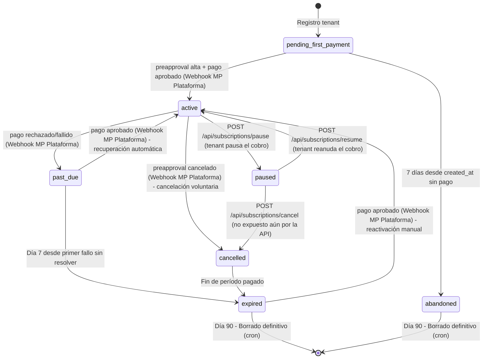

# Spec Transversal — Ciclo de vida de suscripciones

**Fecha:** 2026-09-17
**Versión:** 1.0
**Estado:** Single source of truth para todas las fases

> **Referencia:** Cada fase del blueprint que toque suscripciones debe referenciar este documento en lugar de duplicar lógica.

---

## 1. Máquina de estados (7 estados)

### Estados

| Estado                  | Descripción                                                  | Acceso panel   | Tienda pública          |
| ----------------------- | ------------------------------------------------------------ | -------------- | ----------------------- |
| `pending_first_payment` | Registrado, pago inicial pendiente                           | ❌ Bloqueado   | ❌ No publicada         |
| `active`                | Al día, suscripción vigente                                  | ✅ Completo    | ✅ Funcionando          |
| `past_due`              | Pago falló (dentro de gracia 7 días)                         | ⚠ Limitado     | ✅ Funcionando          |
| `paused`                | Cobro suspendido por el tenant (MP no debita)                | ⚠ Limitado     | ✅ Funcionando          |
| `cancelled`             | Canceló voluntariamente (vence al fin de período)            | ⚠ Solo lectura | ✅ Hasta fin de período |
| `expired`               | Pasó gracia sin pagar                                        | ❌ Bloqueado   | ❌ Despublicada         |
| `abandoned`             | Nunca completó primer pago (7 días desde registro sin pagar) | ❌ Bloqueado   | ❌ No publicada         |

### Transiciones válidas

> **Nota sobre los nombres de evento (corregido 2026-10-01).** Este diagrama
> usaba nombres como `preapproval.created` / `payment.created` / `payment.failed`
> que **no existen como topics en MercadoPago**. Son **descripciones
> semánticas** de la transición, no literales de la API. Para los topics y
> `type`/`action` reales ver §6 (verificado contra la doc de MP el 2026-10-01).
> Los literales exactos por topic se confirman en el spike T0 de Fase 2
> (issue #164).


```mermaid
stateDiagram-v2
    [*] --> pending_first_payment : Registro tenant
    pending_first_payment --> active : preapproval alta + pago aprobado (Webhook MP Plataforma)
    pending_first_payment --> abandoned : 7 días desde created_at sin pago
    active --> past_due : pago rechazado/fallido (Webhook MP Plataforma)
    past_due --> active : pago aprobado (Webhook MP Plataforma) - recuperación automática
    past_due --> expired : Día 7 desde primer fallo sin resolver
    active --> cancelled : preapproval cancelado (Webhook MP Plataforma) - cancelación voluntaria
    active --> paused : POST /api/subscriptions/pause (tenant pausa el cobro)
    paused --> active : POST /api/subscriptions/resume (tenant reanuda el cobro)
    paused --> cancelled : POST /api/subscriptions/cancel (no expuesto aún por la API)
    cancelled --> expired : Fin de período pagado
    expired --> active : pago aprobado (Webhook MP Plataforma) - reactivación manual
    expired --> [*] : Día 90 - Borrado definitivo (cron)
    abandoned --> [*] : Día 90 - Borrado definitivo (cron)
```

### Estado `paused` — modelado (decisión 2026-10-03)

MercadoPago tiene un estado `paused` para preapprovals. Este transversal
**ahora lo modela como estado de primera clase** (antes figuraba como "no
modelado", decisión del planning de Fase 2 que quedó superada).

**Definición:** suscripción con **cobro temporalmente interrumpido**. MercadoPago
deja de debitar los pagos hasta que se reactive. Fuente: [doc oficial de
MercadoPago — Manage subscription plan](https://www.mercadopago.com.ar/developers/es/docs/subscription-plans/manage-subscription-plan).

**Por qué existe en la máquina de estados (no es un descuido):** `cancel` es
**terminal** en MercadoPago. El spike del 2026-10-03 verificó que
`cancelled → authorized` devuelve **400** (`Invalid transition from cancelled to
authorized`). Sin `paused`, un tenant que quisiera volver se quedaría sin
camino: la pausa es el único mecanismo reversible.

**Semántica decidida:**

| Aspecto                 | Decisión                                                                                                        |
| ----------------------- | --------------------------------------------------------------------------------------------------------------- |
| Qué suspende            | El **cobro**, no el servicio. El tenant conserva storefront y panel.                                            |
| `canPause`              | Solo desde `active`.                                                                                            |
| `canResume`             | Solo desde `paused`.                                                                                            |
| `canAccessPanel`        | `'limited'`. No `'readonly'` porque el tenant pausado tiene una acción útil: `resume`.                          |
| Relación con `past_due` | Son distintos. `past_due` es **impago** (dunning, gracia de 7 días, §3). `paused` es **suspensión voluntaria**. |

**Discrepancia conocida con la API (a resolver):** la transición
`paused → cancelled` existe en MercadoPago y figura en el diagrama, pero
`derivePermissions` de T4 devuelve `canCancel: false` para `paused`. MP la
acepta; nuestra API todavía no la expone. Mientras tanto, la UI ofrece
"reanudar", no "irse". Ver item 49.

> **Validación empírica pendiente.** El preapproval `24b2a868` quedó pausado el
> 2026-10-03. El 2026-11-03 se verifica si MercadoPago intentó cobrar durante la
> pausa. Si intentó, la definición de arriba es incorrecta y hay que cambiarla
> antes deffeundarla por buena en el código.

### Transición `cancelled → active`: **eliminada** (verificada imposible)

Este transversal antes documentaba `cancelled → active` vía
`PUT /preapproval/{id} {status:"authorized"}`. **Se eliminó porque el spike la
refutó**: MercadoPago responde **400** a esa transición.

Consecuencia de producto: **la cancelación es irreversible.** Un tenant que
cancela y se arrepiente tiene que crear una suscripción nueva. La UI debe
advertirlo antes de confirmar y **no** ofrecer "reactivar" después de cancelar.

`expired → active` sigue en el diagrama: **no** fue verificada contra MP en el
spike, así que no se afirma ni se niega acá. Si T5 la usa, verificarla primero.

### Qué dispara cada transición

> **Nombres de evento (corregido 2026-10-01):** la columna "Disparador" usa
> **descripciones semánticas**, no literales de la API. Los literales reales
> (`type`/`action` por topic) están en §6 y se confirman en el spike T0
> (issue #164).

| Transición                            | Disparador                                                      | Origen                                   |
| ------------------------------------- | --------------------------------------------------------------- | ---------------------------------------- |
| `pending_first_payment` → `active`    | Preapproval dado de alta + pago aprobado                        | Webhook MP Plataforma (`MP_PLATFORM_*`)  |
| `pending_first_payment` → `abandoned` | Cron: `created_at + 7d` sin pago aprobado                       | Job interno (cron nocturno, UTC)         |
| `active` → `past_due`                 | Cobro rechazado / fallido                                       | Webhook MP Plataforma                    |
| `past_due` → `active`                 | Cobro aprobado (reintento exitoso de MP)                        | Webhook MP Plataforma                    |
| `past_due` → `expired`                | Cron: día 7 desde primer fallo sin resolver                     | Job interno (cron nocturno, UTC)         |
| `active` → `cancelled`                | Preapproval cancelado (tenant cancela)                          | Webhook MP Plataforma                    |
| `active` → `paused`                   | Tenant pausa el cobro                                           | Backend (`POST /pause`)                  |
| `paused` → `active`                   | Tenant reanuda el cobro                                         | Backend (`POST /resume`)                 |
| `paused` → `cancelled`                | Tenant cancela desde pausa (MP lo acepta; API no lo expone aún) | Backend (`POST /cancel`, pendiente)      |
| `cancelled` → `expired`               | Fin de `current_period_end`                                     | Job interno (cron nocturno, UTC)         |
| `expired` → `active`                  | Cobro aprobado (pago manual)                                    | Webhook MP Plataforma / Botón "Ya pagué" |
| `expired` → `[borrado]`               | Cron: 90 días desde `expired_at`                                | Job interno (cron nocturno, UTC)         |
| `abandoned` → `[borrado]`             | Cron: 90 días desde `abandoned_at`                              | Job interno (cron nocturno, UTC)         |

---

## 2. Reglas de negocio por estado

### Tabla resumen: Estado × Permisos

| Acción                           | `pending_first_payment` | `active`    | `past_due` | `paused`   | `cancelled`            | `expired` | `abandoned` |
| -------------------------------- | ----------------------- | ----------- | ---------- | ---------- | ---------------------- | --------- | ----------- |
| **Acceder panel admin**          | ❌                      | ✅ Completo | ⚠ Limitado | ⚠ Limitado | ⚠ Solo lectura         | ❌        | ❌          |
| **Ver productos/órdenes/config** | ❌                      | ✅          | ✅         | ✅         | ✅                     | ❌        | ❌          |
| **Crear/editar productos**       | ❌                      | ✅          | ❌         | ❌         | ❌                     | ❌        | ❌          |
| **Crear/editar categorías**      | ❌                      | ✅          | ❌         | ❌         | ❌                     | ❌        | ❌          |
| **Gestionar órdenes**            | ❌                      | ✅          | ✅         | ✅         | ✅                     | ❌        | ❌          |
| **Recibir órdenes (storefront)** | ❌                      | ✅          | ✅         | ✅         | ✅                     | ❌        | ❌          |
| **Configurar MP, envíos, etc.**  | ❌                      | ✅          | ❌         | ❌         | ❌                     | ❌        | ❌          |
| **Cambiar de plan**              | ❌                      | ✅          | ❌         | ❌         | ❌                     | ❌        | ❌          |
| **Pausar el cobro**              | ❌                      | ✅          | ❌         | ❌         | ❌                     | ❌        | ❌          |
| **Reanudar el cobro**            | ❌                      | ❌          | ❌         | ✅         | ❌                     | ❌        | ❌          |
| **Tienda pública accesible**     | ❌                      | ✅          | ✅         | ✅         | ✅ (hasta fin período) | ❌        | ❌          |

### Detalle por estado

**`pending_first_payment`**

- Panel: muestra pantalla "Configura tu MP y paga la suscripción"
- Storefront: 404 o página "Próximamente"
- Webhook MP Plataforma: espera alta del preapproval + pago aprobado (ver §6)
- Si no paga en 7 días → transiciona a `abandoned` (cron `created_at + 7d`)

**`active`**

- Acceso total al panel y storefront
- Todas las features del tier habilitadas
- Renovación automática mensual vía `preapproval`

**`past_due`** (gracia 7 días)

- Panel: banner superior "Tu pago falló, tienes 7 días para resolver"
- Acciones de escritura bloqueadas (productos, categorías, config)
- Lectura permitida (ver órdenes, productos, stats)
- Storefront: sigue funcionando normal (clientes pueden comprar)
- Emails automáticos día 0, 3, 5, 7
- Webhook MP Plataforma: si llega un cobro aprobado → back to `active`

**`paused`** (suspensión voluntaria del tenant)

- Cobro **suspendido**: MercadoPago no debita. El servicio sigue dado.
- Panel: banner "Tu cobro está pausado. Reanudá cuando quieras" + acción `resume`
- Storefront: funciona normal (lo suspension es el cobro, no el acceso)
- Escritura bloqueada (productos, categorías, config): coherente con `past_due`
- **Reanudar:** botón "Reanudar" → `POST /api/subscriptions/resume` → MP procesa
  → webhook confirma → `paused` → `active`. Vuelve el cobro automático.
- **Cancelar:** la transición existe en MP pero la API todavía no la expone
  (ver §1). Hoy el camino desde `paused` es volver a `active` y cancelar desde ahí.
- **No es impago.** Si el tenant no puede pagar y el cobro falla, eso es
  `past_due` (§3), no `paused`. La pausa es siempre una decisión del tenant.

**`cancelled`**

- El tenant pidió cancelar → sigue activo hasta `current_period_end`
- Panel: solo lectura, banner "Suscripción cancelada, acceso hasta DD/MM"
- Storefront: funciona hasta fin de período
- No puede cambiar de plan ni configurar nada nuevo
- Al llegar `current_period_end` → `expired`
- **Política:** No se reintegra tiempo no usado (estándar SaaS).
- **Irreversible (verificado 2026-10-03):** `cancelled → active` devuelve **400**
  en MercadoPago. No hay "reactivar". Un tenant que cancela y se arrepiente
  debe crear una suscripción nueva. Ver §1.

**`expired`**

- Panel: bloqueado, muestra "Cuenta suspendida" + botón "Reactivar"
- Storefront: 404 / despublicada
- Datos retenidos 90 días (desde `expired_at`)
- Webhook MP Plataforma: si llega un cobro aprobado (pago manual) → `active`
- Día 90 → borrado definitivo (cron sobre `expired_at`)

**`abandoned`**

- Tenant registrado pero nunca completó primer pago (7 días desde `created_at`)
- Panel: bloqueado, muestra "Registro incompleto" + botón "Completar pago"
- Storefront: 404 / no publicada
- Datos retenidos 90 días (desde `abandoned_at`)
- Webhook MP Plataforma: si llega un cobro aprobado → `active` (raro pero posible)
- Día 90 → borrado definitivo (cron sobre `abandoned_at`)

---

## 3. Período de gracia (dunning)

### Configuración

- **Duración:** 7 días corridos desde el primer fallo de pago
- **Estado durante gracia:** `past_due`
- **Tienda pública:** sigue funcionando (clientes compran normal)
- **Panel admin:** limitado (solo lectura + gestión de órdenes)
- **Crons:** todos corren en **UTC** (ver emails día 0/3/5/7, transición a `expired` día 7)

### Secuencia de emails

| Día | Evento                 | Email                     | Asunto sugerido                               |
| --- | ---------------------- | ------------------------- | --------------------------------------------- |
| 0   | Primer fallo detectado | #3 Pago fallido           | "⚠️ Tu pago no pudo procesarse"               |
| 3   | Recordatorio           | #4 Recordatorio día 3     | "Tu suscripción vence en 4 días"              |
| 5   | Último aviso           | #5 Último aviso día 5     | "Último aviso: 2 días para evitar suspensión" |
| 7   | Suspensión             | #6 Suscripción suspendida | "Tu cuenta ha sido suspendida"                |

### Comportamiento durante gracia

- Órdenes nuevas: **se procesan normal** (el tenant cobra a sus clientes con su MP)
- Renovación: **no se cobra** hasta resolver el pago fallido
- Webhook de cobro aprobado (reintento MP) → transición inmediata a `active`
- Si MP no reintenta: botón "Ya pagué, verificar" en panel (consulta `/preapproval/{id}`)

---

## 4. Retención de datos

### Política

- **90 días** desde la transición a `expired` (columna `expired_at`) o `abandoned` (columna `abandoned_at`)
- **Qué se borra:** Todo el tenant cascade (ver abajo)
- **Disparador:** Cron nocturno (UTC) que busca:
  - `subscriptions.status = 'expired' AND expired_at < now() - interval '90 days'`
  - `subscriptions.status = 'abandoned' AND abandoned_at < now() - interval '90 days'`

### Columnas nuevas en `subscriptions` (Fase 1)

| Columna                     | Tipo          | Descripción                                                                                                                                                                                                                                |
| --------------------------- | ------------- | ------------------------------------------------------------------------------------------------------------------------------------------------------------------------------------------------------------------------------------------ |
| `expired_at`                | `TIMESTAMPTZ` | Se setea **solo** en transición a `expired`; se limpia (NULL) al reactivar a `active`                                                                                                                                                      |
| `abandoned_at`              | `TIMESTAMPTZ` | Se setea **solo** en transición a `abandoned`; se limpia si paga y va a `active`                                                                                                                                                           |
| `last_processed_payment_id` | `TEXT`        | `data.id` del último **cobro aprobado** procesado (idempotencia webhooks). NULL inicial.                                                                                                                                                   |
| `current_period_end`        | `TIMESTAMPTZ` | **Nullable.** NULL en `pending_first_payment` / `abandoned`. Seteado a `now() + 1 month` al activar (`active`), reseteado al recobrar (`past_due` → `active`), mantiene valor en `cancelled` hasta fin de período, histórico en `expired`. |

> **Por qué no `updated_at`:** `updated_at` cambia con cualquier update (reintentos, webhooks, etc.) y no refleja el momento real de expiración/abandono.

### Cuándo se setea `current_period_end` según estado

| Estado                  | `currentPeriodEnd`                          |
| ----------------------- | ------------------------------------------- |
| `pending_first_payment` | NULL (todavía no hay período)               |
| `active`                | `now() + 1 month` (seteado al activar)      |
| `past_due`              | Se mantiene (el período pagado sigue)       |
| `cancelled`             | Se mantiene hasta el fin del período pagado |
| `expired`               | Se mantiene (histórico)                     |
| `abandoned`             | NULL (nunca se pagó)                        |

### Tablas afectadas (CASCADE via FK)

| Tabla                            | Relación                     | Acción  |
| -------------------------------- | ---------------------------- | ------- |
| `tenants`                        | PK                           | DELETE  |
| `subscriptions`                  | FK `tenant_id`               | CASCADE |
| `tenant_mp_config`               | FK `tenant_id`               | CASCADE |
| `products`                       | FK `tenant_id`               | CASCADE |
| `product_variants`               | FK `product_id` → `products` | CASCADE |
| `product_images`                 | FK `product_id` → `products` | CASCADE |
| `categories`                     | FK `tenant_id`               | CASCADE |
| `customers`                      | FK `tenant_id`               | CASCADE |
| `orders`                         | FK `tenant_id`               | CASCADE |
| `order_items`                    | FK `order_id` → `orders`     | CASCADE |
| `shipping_methods`               | FK `tenant_id`               | CASCADE |
| `coupons`                        | FK `tenant_id`               | CASCADE |
| `coupon_usage`                   | FK `coupon_id` → `coupons`   | CASCADE |
| `newsletter_subscribers`         | FK `tenant_id`               | CASCADE |
| `newsletter_campaigns`           | FK `tenant_id`               | CASCADE |
| `promo_banners` / `promo_popups` | JSONB en `tenants.settings`  | CASCADE |

### Auditoría

- Log estructurado antes del borrado:
  ```json
  {
    "event": "tenant_purge",
    "tenantId": "...",
    "subscriptionId": "...",
    "expiredAt": "...",
    "purgedAt": "now()"
  }
  ```
- No se envía email al tenant (ya recibió "suspendida" día 7)

---

## 5. Prorrateo en cambio de plan

### Fórmula general

```
crédito = (precio_actual × días_restantes / días_período) - (precio_nuevo × días_restantes / días_período)
```

> Si `crédito > 0` → tenant tiene saldo a favor (se descuenta del próximo cobro).
> Si `crédito < 0` → tenant debe diferencia (se cobra en próximo ciclo o inmediato según implementación MP).

### Ejemplo concreto

**Escenario:** Pro (UYU 4.000/mes) día 1 → Business (UYU 8.000/mes) día 15 (mes de 30 días)

- Días restantes = 15
- Pro rateado = 4.000 × 15/30 = **UYU 2.000** (lo que ya "pagó" por días no usados)
- Business rateado = 8.000 × 15/30 = **UYU 4.000** (costo de días restantes en nuevo plan)
- **Diferencia a cobrar ahora:** 4.000 - 2.000 = **UYU 2.000**

**Downgrade:** Business (UYU 8.000) día 1 → Pro (UYU 4.000) día 15

- Business rateado = 8.000 × 15/30 = UYU 4.000
- Pro rateado = 4.000 × 15/30 = UYU 2.000
- **Crédito a favor:** UYU 2.000 (se aplica al próximo cobro mensual)

### Implementación en MP

> **Premisa corregida (2026-10-01).** La versión anterior de este documento
> decía _"MP Preapproval no soporta prorrateo nativo"_. **Eso era falso.**
> MP expone `auto_recurring.billing_day_proportional` y una página de
> documentación dedicada a prorrateo ("Proportional amount (proration)").
>
> **La conclusión se mantiene, la premisa se corrige:** `billing_day_proportional`
> proratea el **primer cobro** según el día de alta del preapproval. **No**
> implementa la fórmula de crédito/diferencia entre dos planes que describe
> esta sección. Por eso nuestra app calcula el prorrateo y MP solo ve el monto
> mensual nuevo.

- **Upgrade:** Crear `preapproval` nueva con monto Business, cancelar la Pro. MP cobra diferencia prorrateada según su lógica interna, o nosotros cobramos la diferencia via `payment` inmediato.
- **Downgrade:** Cancelar preapproval actual, crear nueva con monto menor. **No se acredita el tiempo no usado al hacer downgrade** (política estándar de SaaS). El nuevo monto aplica desde el próximo ciclo.
- **Nota:** Nuestra app implementa la fórmula de arriba porque MP no provee esa funcionalidad específica (crédito/diferencia entre dos planes). La fórmula es una **función pura** en nuestra app: testeable sin MP, sin red, sin reloj externo.

---

## 6. Webhooks y mapeo de eventos MP → estados internos

### Topics reales de MercadoPago (corregido 2026-10-01)

> **Este bloque reemplaza la versión anterior**, que usaba nombres de evento
> (`preapproval.created`, `payment.failed`, `preapproval.canceled`,
> `preapproval.updated`) que **no existen como topics en MercadoPago**.
> Verificado contra la doc de MP el 2026-10-01.

El payload del webhook trae `type` + `action` **separados**, más `data.id`,
`live_mode`, `api_version`, `date_created`, `user_id`:

```json
{
  "id": 12345,
  "live_mode": true,
  "type": "payment",
  "api_version": "v1",
  "action": "payment.created",
  "date_created": "2015-03-25T10:04:58.396-04:00",
  "user_id": 44444,
  "data": { "id": "999999999" }
}
```

**Topics aplicables a Suscripciones** y su endpoint de resolución:

| Topic                             | Qué es                                        | `data.id` apunta a | Resolver con                    |
| --------------------------------- | --------------------------------------------- | ------------------ | ------------------------------- |
| `subscription_preapproval`        | Alta / baja / actualización de la suscripción | preapproval        | `GET /preapproval/{id}`         |
| `subscription_authorized_payment` | Cobro recurrente (creación / actualización)   | **invoice**        | `GET /authorized_payments/{id}` |
| `payment`                         | Pagos (también aplica a Suscripciones)        | payment            | `GET /v1/payments/{id}`         |
| `subscription_preapproval_plan`   | Planes de suscripción                         | preapproval_plan   | Fuera de alcance en Fase 2      |

> **`subscription_authorized_payment` NO se resuelve con `/v1/payments/{id}`.**
> Es un recurso distinto ("Get invoice data"). Confundirlos rompe el despacho.

> **Los literales exactos de `type` y `action` por topic se verifican en el
> spike T0 de Fase 2** (issue #164). Hasta entonces, el handler de Fase 2
> **despacha por `type`** (que sí está verificado) y trata cualquier
> combinación desconocida como no-op con log `warn`. No se adivinan literales.

> **Literal de `status` por topic: verificado en el spike T0 (2026-10-03).**
> `subscription_preapproval` trae `status: authorized` cuando el alta queda
> confirmada. `payment` trae `data.id` pero **no** trae `status` de suscripción.
> Ojo con el campo `live_mode`: **solo viene en `payment`**. Los topics de
> suscripción **no** lo incluyen, así que "ausente" debe tratarse distinto de
> `false`.

### Mapeo topic → estado interno

> **Decisión de producto (Luis, 2026-10-03): opción B.** El alta se activa desde
> `subscription_preapproval` con `status: authorized`, **no** desde
> `subscription_authorized_payment`. Razón: `subscription_preapproval` es el
> evento que confirma el estado del preapproval, mientras que
> `subscription_authorized_payment` confirma el cobro. Se elige la fuente de
> verdad del preapproval y se acepta el costo de latencia de esperar el tercer
> evento del flujo (`payment` → `subscription_authorized_payment` →
> `subscription_preapproval`).
>
> Consecuencia operativa: hay una ventana en la que MP ya cobró y nuestra DB
> todavía dice `pending_first_payment`. La UI debe tolerar ese estado.

| Topic + `action` (semántico)             | Estado previo           | Estado nuevo | Acciones                                                                                                       |
| ---------------------------------------- | ----------------------- | ------------ | -------------------------------------------------------------------------------------------------------------- |
| `subscription_preapproval` (alta)        | `pending_first_payment` | `active`     | **Alta (opción B).** Set `current_period_end = now() + 1 month`, activar panel                                 |
| Cobro aprobado                           | `past_due`              | `active`     | Reset gracia, set nuevo `current_period_end`                                                                   |
| Cobro aprobado                           | `expired`               | `active`     | Reactivación manual, set nuevo `current_period_end`                                                            |
| Cobro rechazado / fallido                | `active`                | `past_due`   | Iniciar gracia 7d, email #3, set `current_period_end` sin cambios                                              |
| Cobro rechazado / fallido                | `past_due`              | (sin cambio) | Reiniciar contador gracia? No, mantener día 0 original                                                         |
| `subscription_preapproval` (cancelado)   | `active` / `past_due`   | `cancelled`  | Set `current_period_end` = fin de período actual                                                               |
| `subscription_preapproval` (paused)      | `active`                | `paused`     | **Modelado desde 2026-10-03.** Transición disparada por `POST /pause` (§1). No alterar el período.             |
| `subscription_preapproval` (authorized)  | `paused`                | `active`     | Reanudación. Disparada por `POST /resume` (§1). Set nuevo `current_period_end`                                 |
| `subscription_preapproval` (actualizado) | Cualquiera              | (eval)       | **Solo si el monto nuevo != monto guardado** → upgrade/downgrade con prorrateo. Si no → ignorar + log warning. |

### El tenant se resuelve desde MP, no desde el payload

> **Hallazgo de seguridad contractual (2026-10-01).** El body del webhook
> **NO trae `external_reference`**. Ese campo pertenece al objeto preapproval y
> solo se obtiene consultando `GET /preapproval/{id}` o
> `GET /authorized_payments/{id}`.

Consecuencia: el handler necesita `MP_PLATFORM_ACCESS_TOKEN` y hace una llamada
saliente a MP en cada webhook para resolver el tenant. Diseño de Fase 2:

- **Estrategia L** (local, sin red): `SELECT tenantId FROM subscriptions WHERE mpPreapprovalId = $1`
- **Estrategia R** (remota): consulta a MP, lee `external_reference` o `preapproval_id`
- Si ninguna resuelve → `200` + log `warn` (nunca 5xx: MP reintentaría en loop)

Ver `docs/superpowers/specs/2026-10-01-fase2-design.md` §2.1.

### Nota sobre `notification_url`

> **MP se contradice (verificado 2026-10-01).** La doc de _Subscriptions →
> Webhooks_ afirma que para Suscripciones la URL **no** se puede configurar por
> panel y hay que hacerlo "al crear el pago". Pero los body params de
> `POST /preapproval` **no documentan `notification_url`** (el campo aparece
> documentado en Preferences API e IPN).
>
> Si el campo existe y no se manda, ninguna suscripción se activa. **El spike T0
> lo resuelve empíricamente.** Ver issue #173.

### Flujo de cancelación (initiado por tenant)

1. Tenant hace clic en "Cancelar suscripción" en panel admin.
2. Backend llama `PUT /preapproval/{id}` a MP con `status: "cancelled"` (usa `MP_PLATFORM_ACCESS_TOKEN`).
3. **Si MP devuelve error (4xx/5xx):**
   - Registrar error en log estructurado (`event: "cancel_failed", tenantId, preapprovalId, error`).
   - Mostrar al tenant: "No pudimos procesar la cancelación, intentá de nuevo en unos minutos".
   - **No transicionar a `cancelled`** hasta que MP confirme vía webhook.
   - El tenant puede reintentar.
4. **Si MP acepta (2xx):** MP procesa y envía el webhook de cancelación (topic `subscription_preapproval`).
5. Handler procesa webhook → transición a `cancelled` (set `current_period_end` = fin de período actual).
6. **Política:** No se reintegra el tiempo no usado (estándar SaaS). Acceso hasta `current_period_end`.

### Idempotencia de webhooks (suscripciones)

MP puede reenviar el mismo evento (reintentos, race conditions). Para evitar procesar dos veces:

- **Columna nueva en `subscriptions` (Fase 1):** `last_processed_payment_id TEXT` — guarda el `data.id` del último **cobro aprobado** procesado exitosamente.
- **Regla en el handler de cobro aprobado:**
  1. Extraer `payment.id` del payload.
  2. Si `last_processed_payment_id = payment.id` → **ignorar** (ya procesado), responder 200 OK.
  3. Si `subscription.status` ya es el estado destino (ej: `active` → `active`) → **ignorar**, responder 200 OK.
  4. Si no, procesar transición, actualizar `last_processed_payment_id = payment.id`, responder 200 OK.
- **Aplicabilidad:** Solo eventos de **cobro** (topic `subscription_authorized_payment` o `payment`). Los eventos de `subscription_preapproval` son idempotentes **por convergencia**: se compara el estado autoritativo de MP contra el estado en DB y solo se escribe si difieren. Reprocesar N veces produce el mismo resultado.
- **Nota sobre `payment.id`:** el `id` que se guarda es el de la **entidad resuelta** (invoice para `subscription_authorized_payment`, payment para `payment`). Ver §6.

### Reintento automático (webhook no llega)

- **Frecuencia:** cada 5 minutos
- **Duración:** 2 horas (24 intentos)
- **Zona horaria:** **UTC** (todos los crons corren en UTC)
- **Mecanismo:** Job que consulta `subscriptions` en `pending_first_payment` o `past_due` sin `payment.created` reciente, llama `GET /preapproval/{id}` a MP
- **Si MP confirma pago:** procesar como cobro aprobado
- **Después de 2h:** solo queda botón manual "Ya pagué, verificar" en panel

### Fallback manual: "Ya pagué, verificar"

- Botón en panel cuando estado = `pending_first_payment` o `past_due`
- Llama `GET /preapproval/{mp_preapproval_id}` con `MP_PLATFORM_ACCESS_TOKEN`
- Si `status = "authorized"` y hay pago aprobado reciente → procesar transición
- Rate limit: 1 consulta cada 30 segundos por tenant

---

## 7. Emails (7)

| #   | Evento                 | Trigger                            | Destinatario            | Contenido clave                                           |
| --- | ---------------------- | ---------------------------------- | ----------------------- | --------------------------------------------------------- |
| 1   | Bienvenida             | Registro tenant                    | Tenant (email registro) | Bienvenida, link a panel para configurar MP               |
| 2   | Pago confirmado        | `pending_first_payment` → `active` | Tenant                  | "Tu suscripción está activa", acceso al panel             |
| 3   | Pago fallido           | `active` → `past_due` (día 0)      | Tenant                  | "Tu pago no pudo procesarse", link a panel, 7 días gracia |
| 4   | Recordatorio día 3     | Cron día 3 gracia                  | Tenant                  | "Quedan 4 días para regularizar"                          |
| 5   | Último aviso día 5     | Cron día 5 gracia                  | Tenant                  | "Últimas 48hs antes de suspensión"                        |
| 6   | Suscripción suspendida | `past_due` → `expired` (día 7)     | Tenant                  | "Cuenta suspendida", botón reactivar, 90 días retención   |
| 7   | Suscripción cancelada  | `cancelled` confirmado             | Tenant                  | "Cancelación confirmada, acceso hasta DD/MM"              |

### Notas técnicas

- **Proveedor:** Resend (via `@repo/commerce/email.ts`)
- **Plantillas:** React Email / HTML en `packages/commerce/src/emails/`
- **Idempotencia:** Cada email tiene `message_id` único por evento + tenant
- **Idioma:** Español (configurable por tenant en Fase 4)
- **Unsubscribe:** Solo emails transaccionales (no marketing). Newsletter aparte (Fase 8).

---

## 8. Contrato con los dos flujos de MP

### Flujo A — Suscripciones (Plataforma)

| Elemento           | Valor                                                                    |
| ------------------ | ------------------------------------------------------------------------ |
| Cuenta MP          | LandaetaStudio (plataforma)                                              |
| Access Token       | `MP_PLATFORM_ACCESS_TOKEN` (env)                                         |
| Webhook Secret     | `MP_PLATFORM_WEBHOOK_SECRET` (env)                                       |
| Webhook URL        | `/api/webhooks/mercadopago/subscriptions`                                |
| App que lo sirve   | `apps/admin` (ver nota abajo)                                            |
| Qué cobra          | Suscripción mensual (UYU 2.000 / 4.000 / 8.000)                          |
| External reference | `tenantId` (UUID)                                                        |
| Eventos relevantes | `subscription_preapproval`, `subscription_authorized_payment`, `payment` |

> **URL fija, sin path templating (corregido 2026-10-01).** La versión anterior
> de esta tabla decía `/api/webhooks/mercadopago/subscriptions/:tenantId`.
> **Es imposible de implementar:** MercadoPago registra **una URL literal** por
> aplicación y por modo. No hace path templating — no conoce tenants y no
> sustituye parámetros. Lo único variable que MP admite es el query param
> `?cliente=<seller>` para identificar cuentas.
>
> El `tenantId` viaja en el **`external_reference`** del preapproval, que **no
> viene en el payload del webhook**: se resuelve consultando MP. Ver §6.

> **Por qué en `apps/admin` y no en `apps/storefront`.** `apps/storefront` tiene
> `proxy.ts`, que resuelve el tenant por **subdominio**. Un webhook de plataforma
> es **por cuenta, no por tenant**, así que se resolvería contra un tenant
> inexistente. `apps/admin` no tiene `proxy.ts` y obtiene el `tenantId` del JWT de
> sesión (`session.user.tenantId`).

### Flujo B — Órdenes de tienda (Tenant)

| Elemento           | Valor                                              |
| ------------------ | -------------------------------------------------- |
| Cuenta MP          | Del tenant (configurada en onboarding)             |
| Access Token       | `tenant_mp_config.access_token` (cifrado, ADR-024) |
| Webhook Secret     | `tenant_mp_config.webhook_secret` (cifrado)        |
| Webhook URL        | `/api/webhooks/mercadopago` (URL fija)             |
| App que lo sirve   | `apps/storefront`                                  |
| Qué cobra          | Órdenes de clientes finales del tenant             |
| External reference | `tenantId:orderId`                                 |
| Eventos relevantes | `payment`                                          |

> **Misma corrección de URL en el Flujo B:** la versión anterior decía
> `/api/webhooks/mercadopago/:tenantId`. Por el mismo motivo **no puede llevar
> path param**. El tenant se resuelve desde el `external_reference`
> (`tenantId:orderId`), que en este flujo **sí viene en el body** porque MP lo
> incluye en el objeto Payment y se lee tras el `GET /v1/payments/{id}`.

### Relación entre flujos

- **Independientes:** Distintas cuentas MP, distintos tokens, distintos webhooks, distintos secrets.
- **Sin cruce de fondos:** Plataforma nunca toca dinero de órdenes; tenant nunca paga su suscripción con su MP.
- **Único vínculo:** `tenantId` (en `external_reference` de suscripción y en `tenant_mp_config.tenant_id`).
- **Referencia:** ADR-023.

---

## 9. Referencias cruzadas

| Documento          | Sección                                                       | Uso                                                    |
| ------------------ | ------------------------------------------------------------- | ------------------------------------------------------ |
| **Blueprint v2.6** | "Arquitectura de pagos — Dos flujos independientes"           | Contexto flujos MP                                     |
| **Blueprint v2.6** | "Flujo de suscripciones — Ciclo de vida completo"             | Estados, gracia, emails, prorrateo                     |
| **Blueprint v2.6** | Fase 2                                                        | Webhook suscripciones + checkout dinámico              |
| **Blueprint v2.6** | Fase 3                                                        | Autoservicio (landing + registro + pago)               |
| **Blueprint v2.6** | Fase 9                                                        | Go-live (verificar flujo completo)                     |
| **ADR-023**        | —                                                             | Decisión dos flujos MP                                 |
| **ADR-024**        | —                                                             | Cifrado tokens tenant (`tenant_mp_config`)             |
| **ADR-022**        | —                                                             | RLS activo en `subscriptions`, `tenant_mp_config`      |
| **Fase 2 spec**    | `docs/superpowers/specs/2026-10-01-fase2-webhook-checkout.md` | Referencia este doc para webhook y estados             |
| **Fase 2 design**  | `docs/superpowers/specs/2026-10-01-fase2-design.md`           | CÓMO: resolución de tenant, idempotencia, transiciones |
| **Fase 2 plan**    | `docs/superpowers/plans/2026-10-01-fase2.md`                  | 9 tasks. Spike T0 = issue #164                         |
| **Fase 3 spec**    | —                                                             | Referencia este doc para registro, pago, gracia        |
| **Fase 9 spec**    | —                                                             | Referencia este doc para checklist go-live             |

---

**Próximos pasos:** Cada fase (2, 3, 9) creará su spec propio referenciando este documento como fuente de verdad para el ciclo de suscripciones.
